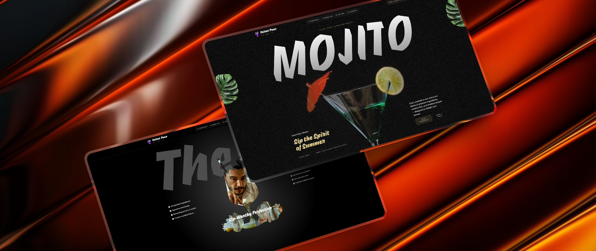

<div align="center">
  <br />
  <a href="https://velvet-pour-five-self.vercel.app/" target="_blank" rel="noopener noreferrer">
    
  </a>
  <br />
  <br />
  <a href="https://velvet-pour-five-self.vercel.app/" target="_blank" rel="noopener noreferrer">
    
  </a>
  <br />
  <h3>Velvet Pour</h3>
  <p>A scroll-driven cocktail landing page built with Next.js, GSAP, Lenis, and Tailwind CSS.</p>
</div>

---

## Tech Stack

- **[Next.js 16](https://nextjs.org/)** — App Router, server routes, and production builds on Vercel.
- **[React 19](https://react.dev/)** — Component-based UI with modular sections and client-side scroll behavior.
- **[GSAP](https://gsap.com/)** — Scroll-driven animation with SplitText, ScrollTrigger, parallax, pinned sections, and timelines via `@gsap/react`.
- **[Lenis](https://lenis.darkroom.engineering/)** — Smooth scrolling integrated with ScrollTrigger-driven sections.
- **[Tailwind CSS 4](https://tailwindcss.com/)** — Utility-first styling with responsive `clamp()` layout.
- **[Convex](https://www.convex.dev/)** — Backend for contact form ingress, rate limiting, and submission storage.
- **[Resend](https://resend.com/)** — Transactional email delivery for contact form messages.

## Features

- **SplitText Animations** — Dynamic text reveals for intros and section highlights.
- **ScrollTrigger Effects** — Scroll-based animations and timeline control.
- **Parallax Scrolling** — Depth effects tied to scroll position.
- **Pinned Sections** — Sections that stay in view while content animates.
- **Scroll-Synced Video Playback** — Video progress synced to scroll.
- **Image Masking Effects** — Scroll-triggered pins and masks for image transitions.
- **Custom Carousel** — Animated slides with custom navigation.
- **Seamless Timeline Animations** — Smooth timelines across multiple sections.
- **Contact Form** — Convex + Resend pipeline with rate limiting and live cooldown UI.
- **Responsive Design** — Fluid UI across mobile, laptop, and desktop.

## How to Run

**Prerequisites:** [Git](https://git-scm.com/), [Node.js](https://nodejs.org/), and [npm](https://www.npmjs.com/).

```bash
git clone https://github.com/acheronx0577/gsap-cocktails.git
cd gsap-cocktails
npm install
npm run dev
```

Open [http://localhost:3000](http://localhost:3000) in your browser.

**Other commands:**

```bash
npm run build   # production build
npm run start   # run production server locally
```
